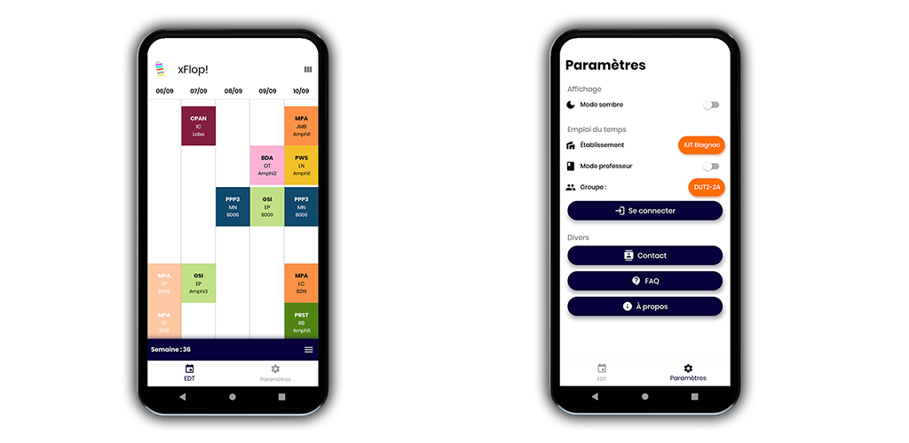

# xFlop

Un application mobile IOS & Android de visualisation d'emploi du temps généré par le logiciel [FlopEDT](http://www.flopedt.org/) 

Pour l'instant destiné aux étudiants et aux professeurs de l'IUT de Blagnac, mais commence à s'étendre à d'autres établissments.

Propulsé grâce au SDK Flutter. 
/!\ Le code est pour l'instant assez mal organisé. Il sera revu plus tard.

Quelques aperçus de l'application :

## Fonctionnalités

- [x] Affichage des cours en temps réel
- [x] Affichage de la semaine entière
- [x] Calcul des 3 prochaines semaines à partir de l'actuelle
- [x] Gestion des week-ends
- [x] Gestion des préférences utilisateurs (groupe, promo)
- [x] Gestion des heures dynamiques
- [x] Les cours terminés de la journée s'affiche en moins clair afin de faciliter la lecture. 
- [x] Si la journée est fini, affiche l'emploi du temps du jour suivant.
- [x] Mode professeur
- [x] Affichage des examens particuliers
- [x] Mode sombre
- [x] Choix de l'établissement

Réalisé par des étudiants de l'IUT de Blagnac : 
 - GOUVEIA Thomas
 - BOGACKI Charles
